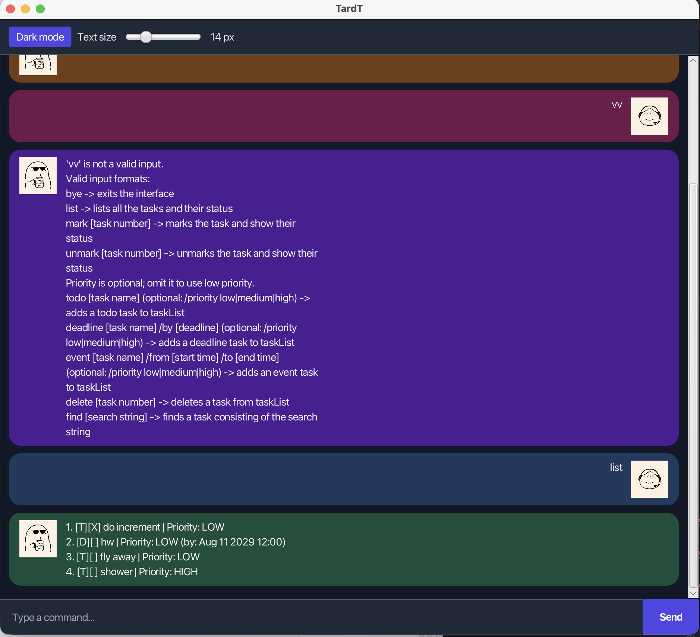

# TardT User Guide

TardT is a desktop task manager for keeping track of to-dos, deadlines, and events. Enter commands in the input box and press Enter; the response and task list appear in the chat area.



## Quick start

1. Ensure Java 25 is installed.
2. Download `TardT.jar` and place it in a folder of your choice.
3. Open a terminal in that folder and run:

   ```sh
   java -jar TardT.jar
   ```

4. Type a command and press Enter. For example, enter `todo read the user guide`.

## Command format

- Words in `UPPER_CASE` are values you supply. For example, replace `DESCRIPTION` in `todo DESCRIPTION` with a task description.
- Items in square brackets are optional.
- Task numbers refer to the numbers displayed by `list` and start at 1.
- Dates and times must use `yyyy-MM-ddTHH:mm`, for example `2026-09-29T12:00`.
- Priorities are `low`, `medium`, or `high`. If no priority is given, TardT uses `low`.

## Features

### Add a to-do: `todo`

Adds a task without a date or time.

Format: `todo DESCRIPTION [/priority PRIORITY]`

Example: `todo submit assignment /priority high`

### Add a deadline: `deadline`

Adds a task that must be completed by a date and time.

Format: `deadline DESCRIPTION /by DATE_TIME [/priority PRIORITY]`

Example: `deadline submit assignment /by 2026-09-29T12:00 /priority high`

### Add an event: `event`

Adds an event with a start and end date and time. The end time must be after the start time.

Format: `event DESCRIPTION /from DATE_TIME /to DATE_TIME [/priority PRIORITY]`

Example: `event project meeting /from 2026-09-20T14:00 /to 2026-09-20T15:00 /priority medium`

### List tasks: `list`

Shows every task and its number, type, completion status, priority, and any associated date or time.

Format: `list`

### Mark or unmark a task: `mark`, `unmark`

Marks a task as completed or changes it back to incomplete.

Formats: `mark TASK_NUMBER` and `unmark TASK_NUMBER`

Examples: `mark 1`, `unmark 1`

### Find tasks: `find`

Shows tasks whose descriptions contain the supplied search text. Matching is case-sensitive.

Format: `find KEYWORD`

Example: `find assignment`

### Delete a task: `delete`

Removes the task at the specified number. Use `list` first to check the task number.

Format: `delete TASK_NUMBER`

Example: `delete 2`

### Exit TardT: `bye`

Closes the application.

Format: `bye`

## Saving data

TardT saves the task list automatically after every change. Its data is stored in `data/tasks.txt` relative to the folder from which the application is run. Do not edit this file unless you have made a backup: invalid entries are skipped when TardT next starts.

## Known problems

- If `data/tasks.txt`, or its `data` folder, cannot be read or written because of file permissions, TardT starts with an empty task list and shows an error. Changes made while the problem remains cannot be saved. Check the folder's permissions or choose a location where you have read and write access, then restart TardT.

## Command summary

Action | Format
--- | ---
Add to-do | `todo DESCRIPTION [/priority PRIORITY]`
Add deadline | `deadline DESCRIPTION /by DATE_TIME [/priority PRIORITY]`
Add event | `event DESCRIPTION /from DATE_TIME /to DATE_TIME [/priority PRIORITY]`
List tasks | `list`
Mark task | `mark TASK_NUMBER`
Unmark task | `unmark TASK_NUMBER`
Find tasks | `find KEYWORD`
Delete task | `delete TASK_NUMBER`
Exit | `bye`
